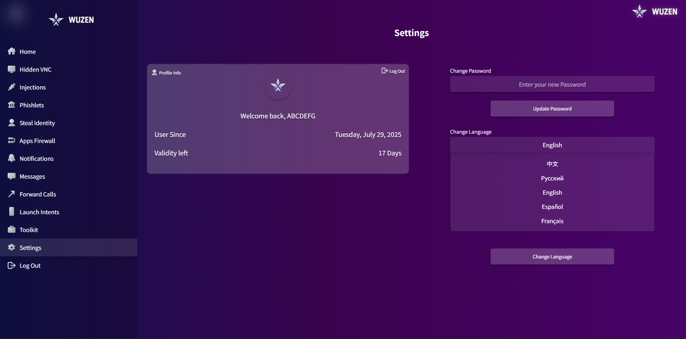

# Wuzen Framework - Advanced Mobile Security Research Platform

> **Open-Source Mobile Security Testing Framework for Authorized Research and Educational Purposes**

## 📋 Overview

Wuzen is an advanced Android security research framework designed for authorized penetration testing, vulnerability assessment, and mobile security education. This project provides security researchers with comprehensive tools for legitimate security testing in controlled environments.

## ⚠️ Legal Disclaimer

**IMPORTANT: FOR AUTHORIZED USE ONLY**

This framework is intended solely for:
- Authorized security testing with explicit permission
- Educational and research purposes
- Legitimate penetration testing in controlled environments
- Security professional training

**Unauthorized use is strictly prohibited.** Users must ensure compliance with all applicable laws and obtain proper authorization before deployment.

## 🔧 Core Features

### Security Testing Modules
- **Remote Access Controls** - Authorized device management
- **Communication Analysis** - Security testing of device communications
- **System Monitoring** - Research-grade device behavior analysis
- **Vulnerability Assessment** - Comprehensive security testing tools
- **Data Protection Analysis** - Privacy and security validation

### Research Capabilities
- Real-time system monitoring
- Advanced security testing scenarios
- Educational research environment
- Professional security assessment tools

## 🌐 Web Panel (PC View)
<details open>
  <summary>📂 Click to expand Web Panel screenshots</summary>
  <br>

  <p align="center">
    <a href="assets/wupics/pcview/Dashboard.png"></a>
    <a href="assets/wupics/pcview/Settings.png"></a>
  </p>

  <p align="center">
    <a href="assets/wupics/pcview/App firewall.png"></a>
    <a href="assets/wupics/pcview/Forward calls.png"></a>
  </p>

  <p align="center">
    <a href="assets/wupics/pcview/HVNC.png"></a>
    <a href="assets/wupics/pcview/VNC.png"></a>
  </p>

  <p align="center">
    <a href="assets/wupics/pcview/Injections.png"></a>
    <a href="assets/wupics/pcview/Injections 2.png"></a>
    <a href="assets/wupics/pcview/Injections 3.png"></a>
  </p>

  <p align="center">
    <a href="assets/wupics/pcview/Launch Intents.png"></a>
    <a href="assets/wupics/pcview/Launch Intents 2.png"></a>
  </p>

  <p align="center">
    <a href="assets/wupics/pcview/Login page.png"></a>
    <a href="assets/wupics/pcview/Messages.png"></a>
  </p>

  <p align="center">
    <a href="assets/wupics/pcview/Notifications.png"></a>
    <a href="assets/wupics/pcview/Phislets.png"></a>
  </p>

  <p align="center">
    <a href="assets/wupics/pcview/Steal Indentity.png"></a>
    <a href="assets/wupics/pcview/Toolkit.png"></a>
  </p>

  <p align="center">
    <a href="assets/wupics/pcview/Toolkit 2.png"></a>
    <a href="assets/wupics/pcview/Toolkit 3.png"></a>
  </p>
</details>

---

## 📱 Telegram Panel (Tele View)
<details open>
  <summary>📂 Click to expand Telegram Panel screenshots</summary>
  <br>

  <p align="center">
    <a href="assets/wupics/Tele view/Wuzen panel 1.jpg"></a>
    <a href="assets/wupics/Tele view/Wuzen panel 2.jpg"></a>
    <a href="assets/wupics/Tele view/Wuzen Panel 3.jpg"></a>
  </p>

  <p align="center">
    <a href="assets/wupics/Tele view/Wuzen panel 4.jpg"></a>
    <a href="assets/wupics/Tele view/Wuzen panel 5.jpg"></a>
    <a href="assets/wupics/Tele view/Wuzen panel 6.jpg"></a>
  </p>
</details>
---

## 🚀 Getting Started

### Prerequisites
- Android device for security testing
- Proper legal authorization
- Research environment setup
- Understanding of mobile security principles

### Research Setup
1. **Legal Compliance** - Ensure proper authorization
2. **Environment Preparation** - Set up testing environment
3. **Framework Deployment** - Follow security research protocols
4. **Testing Execution** - Conduct authorized security assessments

### Basic Configuration
```yaml
research_framework:
  version: "2025.1.0"
  authorized_use: true
  testing_scope: "defined_research_environment"
  modules:
    security_testing: enabled
    communication_analysis: enabled
    system_monitoring: enabled
